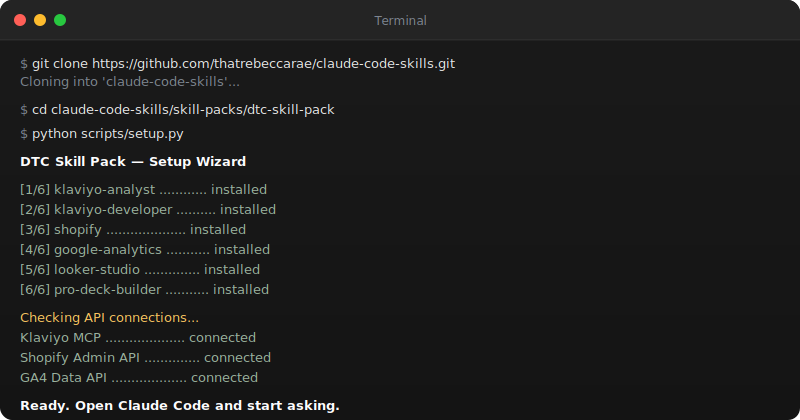

<div align="center">

# DTC Skill Pack

**6 skills that give Claude Code deep expertise in DTC e-commerce marketing.**

[](https://github.com/thatrebeccarae/dgtldept/stargazers)
[](../../LICENSE)
[](https://linkedin.com/in/rebeccaraebarton)
[](https://dgtldept.substack.com/welcome)

Audit Klaviyo flows, diagnose Shopify conversion drop-offs, analyze GA4 traffic, build Looker Studio dashboards, and generate polished slide decks — all from natural language prompts in your terminal.

[**Live Demo**](https://thatrebeccarae.github.io/dgtldept/skill-packs/dtc-skill-pack/demo/) · [**Getting Started**](GETTING_STARTED.md) · [**Back to Repo**](../../README.md)

<br>

<a href="https://thatrebeccarae.github.io/dgtldept/skill-packs/dtc-skill-pack/demo/">
  
</a>

</div>

---

## What's Included

| Skill | What It Does | Includes |
|-------|-------------|----------|
| **[klaviyo-analyst](klaviyo-analyst/)** | 4-phase deep audit of flows, segments, campaigns, deliverability, and revenue attribution. Industry benchmarks and three-tier recommendation format. | SKILL + REFERENCE + EXAMPLES + scripts |
| **[klaviyo-developer](klaviyo-developer/)** | Event tracking, SDK integration, webhooks, rate limits, catalog sync, OAuth. Integration health audit with event schema best practices. | SKILL + REFERENCE + EXAMPLES + scripts |
| **[shopify](shopify/)** | 12-step store audit: conversion funnels, site speed, product pages, tracking setup, marketing stack integration. | SKILL + REFERENCE + EXAMPLES + scripts |
| **[google-analytics](google-analytics/)** | GA4 traffic analysis: sources, engagement, content performance, conversion funnels, device comparison. | SKILL + REFERENCE + EXAMPLES + scripts |
| **[looker-studio](looker-studio/)** | Cross-platform dashboards via Google Sheets pipeline. DTC dashboard templates and calculated field library. | SKILL + REFERENCE + EXAMPLES + scripts |
| **[pro-deck-builder](pro-deck-builder/)** | Polished HTML slide decks and PDF-ready reports. Dark cover pages, warm light content slides, data visualization palette. | SKILL + REFERENCE |

## How the Skills Connect

```
Shopify (orders, products, customers)
    |
    +--> Klaviyo (flows, segments, campaigns, email/SMS)
    |        |
    |        +--> GA4 (traffic, behavior, conversions)
    |        |
    |        +--> Looker Studio (cross-platform dashboards)
    |
    +--> Pro Deck Builder (HTML slide decks and PDF reports from any analysis)
```

Each skill works independently — install only the ones you need. But they complement each other:

- Run a **Shopify** audit to find conversion issues, then check **Klaviyo** flows that address them
- Use **Looker Studio** scripts to push Klaviyo + Shopify data to Google Sheets for unified dashboards
- Analyze **GA4** traffic sources, then cross-reference with **Klaviyo** campaign performance
- Turn any analysis into a polished deck with **Pro Deck Builder**

## Quick Start

### Option 1: Interactive Wizard (Recommended)

```bash
git clone https://github.com/thatrebeccarae/dgtldept.git
cd dgtldept/skill-packs/dtc-skill-pack
python scripts/setup.py
```

The wizard checks prerequisites, walks you through API key setup, installs dependencies, and tests connections.

### Option 2: Copy Skills Directly

```bash
for skill in klaviyo-analyst klaviyo-developer google-analytics shopify looker-studio pro-deck-builder; do
  cp -r "$skill" ~/.claude/skills/
done
```

> [!TIP]
> See [GETTING_STARTED.md](GETTING_STARTED.md) for detailed step-by-step instructions and API key setup per platform.

## Prerequisites

<details>
<summary><strong>Klaviyo MCP Server (for Analyst + Developer skills)</strong></summary>

The [Klaviyo MCP server](https://developers.klaviyo.com/en/docs/klaviyo_mcp_server) gives Claude direct access to your Klaviyo account data.

**1. Create a Klaviyo Private API Key**

1. Log in to [Klaviyo](https://www.klaviyo.com/login) (requires Owner, Admin, or Manager role)
2. Click your **organization name** in the bottom-left corner
3. Go to **Settings** > **API keys**
4. Click **Create Private API Key**
5. Name the key (e.g., `claude-code-mcp`), select **Read-only** scopes
6. Click **Create** and **copy the key immediately**

```bash
# Add to ~/.zshrc or ~/.bashrc
export KLAVIYO_API_KEY="pk_your_key_here"
```

**Recommended scopes:**

| Scope | Minimum (Read-only) | Full Access |
|-------|---------------------|-------------|
| Accounts | Read | Read |
| Campaigns | Read | Full |
| Catalogs | Read | Read |
| Events | Read | Full |
| Flows | Read | Read |
| Lists | Read | Read |
| Metrics | Read | Read |
| Profiles | Read | Full |
| Segments | Read | Full |
| Tags | Read | Read |
| Templates | Read | Full |

**2. Install the MCP Server**

```bash
# Install uv (if not already installed)
curl -LsSf https://astral.sh/uv/install.sh | sh
```

Add to `~/.mcp.json`:

```json
{
  "mcpServers": {
    "klaviyo": {
      "command": "uvx",
      "args": ["klaviyo-mcp-server@latest"],
      "env": {
        "PRIVATE_API_KEY": "${KLAVIYO_API_KEY}",
        "READ_ONLY": "true",
        "ALLOW_USER_GENERATED_CONTENT": "false"
      }
    }
  }
}
```

Restart Claude Code and verify with `/mcp`.

</details>

> [!NOTE]
> The MCP server lets Claude pull live data from your Klaviyo account. Without it, Claude still has full Klaviyo expertise but you'll need to provide data manually (paste metrics, share screenshots, or use the included scripts).

## Example Prompts

### Klaviyo Analyst
- "Audit my Klaviyo account and identify missing flows"
- "My abandoned cart flow has a 1.2% click rate — how do I improve it?"
- "Build an RFM segmentation strategy for my DTC brand"
- "Design an RFM segmentation strategy and present it in a slide deck"

### Klaviyo Developer
- "How do I track a custom event from my Node.js backend?"
- "Set up a bulk profile import script for migrating 50K contacts"
- "Help me handle Klaviyo rate limits in my integration"
- "Debug why my webhook events aren't triggering flows"

### Shopify
- "Audit my Shopify store — focus on conversion funnel and site speed"
- "Which products should I restock based on sales velocity?"
- "What Shopify apps should I add for a DTC brand doing $2M/yr?"

### Google Analytics
- "Which traffic sources are driving the most conversions?"
- "Compare mobile and desktop performance"
- "Analyze our conversion funnel and identify drop-off points"

### Looker Studio
- "Plan a CRM performance dashboard reconciling Klaviyo and Shopify data"
- "Write a calculated field that normalizes GA4 event names"
- "Push our Shopify order data to Google Sheets for Looker Studio"

### Pro Deck Builder
- "Create a dark-mode deck summarizing this month's email performance"
- "Build a monthly marketing performance presentation with charts"

## FAQ

<details>
<summary><strong>Do I need all six skills?</strong></summary>

No. Install only the skills for platforms you use. Each skill works independently. The Klaviyo Analyst skill is the recommended starting point.

</details>

<details>
<summary><strong>What Klaviyo API scopes are needed?</strong></summary>

Read-only scopes are sufficient for all audit and analysis tasks. Only enable write scopes if you want Claude to help build integrations that modify data.

</details>

<details>
<summary><strong>Can I use this with multiple Klaviyo accounts?</strong></summary>

Yes. Configure multiple MCP server entries in `~/.mcp.json` with different environment variable names (e.g., `KLAVIYO_API_KEY_BRAND1`, `KLAVIYO_API_KEY_BRAND2`).

</details>

<details>
<summary><strong>How is this different from Klaviyo's built-in AI?</strong></summary>

Klaviyo's AI features work within the Klaviyo UI for specific tasks (subject line generation, segment suggestions). This skill pack gives Claude deep, cross-platform expertise: it can audit your entire DTC marketing stack, compare Klaviyo data with Shopify and GA4, produce implementation specs, and generate presentation decks — all from natural language prompts in your terminal.

</details>

## Resources

- [Klaviyo MCP Server Documentation](https://developers.klaviyo.com/en/docs/klaviyo_mcp_server)
- [Klaviyo API Reference](https://developers.klaviyo.com/en/reference/api_overview)
- [Shopify Admin API Reference](https://shopify.dev/docs/api/admin-rest)
- [Google Analytics Data API](https://developers.google.com/analytics/devguides/reporting/data/v1)
- [Looker Studio Help](https://support.google.com/looker-studio)
- [Claude Code Documentation](https://docs.anthropic.com/en/docs/claude-code)

## License

[MIT](../../LICENSE) — built by [Rebecca Rae Barton](https://linkedin.com/in/rebeccaraebarton)
